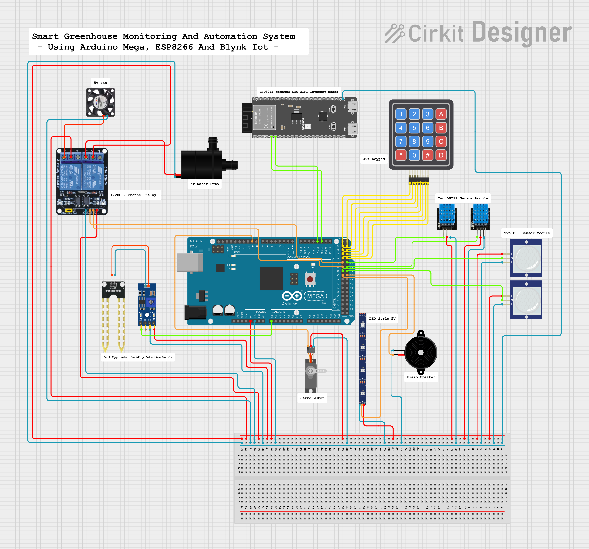
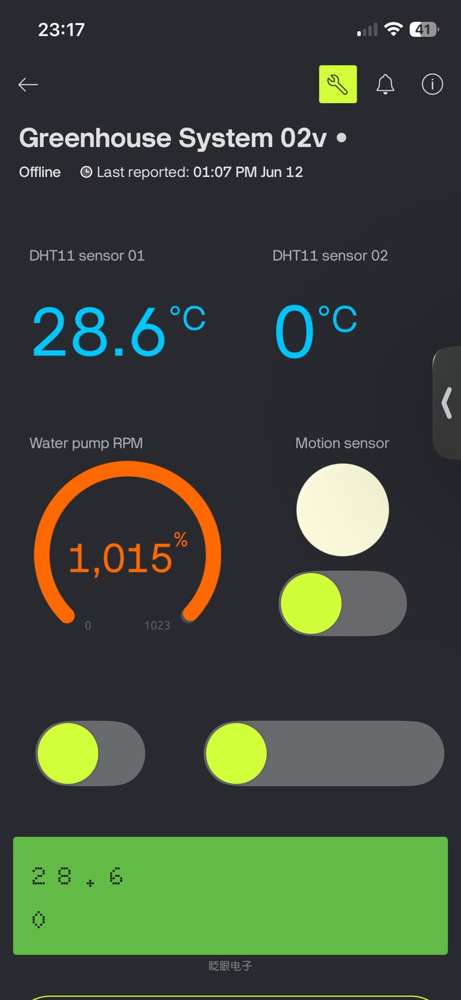

# 🌱 Smart Greenhouse Monitoring and Automation System

### 🚀 IoT-Based Smart Agriculture Solution

Monitor and control greenhouse conditions in real-time using Arduino Mega, ESP8266 NodeMCU, Blynk IoT, and Smart Sensors.

 
 
 
 

---

## 📸 Project Preview

### Prototype

### Wiring Diagram

### Blynk Dashboard

---

## 🎯 Project Objectives

✔ Monitor Temperature & Humidity

✔ Monitor Soil Moisture

✔ Automated Irrigation System

✔ Automated Ventilation System

✔ Motion Detection & Security

✔ Remote Monitoring using Blynk IoT

✔ Real-Time Sensor Data Visualization

---

## 🛠 Hardware Components

* Arduino Mega 2560
* ESP8266 NodeMCU
* DHT11/DHT22 Sensors
* Soil Moisture Sensor
* PIR Motion Sensors
* Relay Module
* Water Pump
* Servo Motor
* Buzzer
* LEDs

---

## 💻 Software Technologies

* Arduino IDE
* Embedded C++
* Blynk IoT Platform
* ESP8266WiFi Library
* Serial Communication

---

## 📂 Project Structure

Smart-Greenhouse-Monitoring-And-Automation-System

├── Arduino_Mega_Code

├── ESP8266_Code

├── Wiring_Diagram

├── Report

├── Images

└── README.md

---

## 🔄 System Workflow

1. Sensors collect environmental data.
2. Arduino Mega processes the sensor readings.
3. ESP8266 transmits data to Blynk Cloud.
4. Users monitor greenhouse conditions remotely.
5. Automatic actions control pumps, fans, alarms, and lighting.

---

## 🌟 Future Improvements

* AI-Based Climate Prediction
* Weather API Integration
* Historical Analytics Dashboard
* Mobile Notifications
* Smart Fertilizer Management

---

## 👨‍💻 Developed By

**R.D. Dhananjana Buddhi Prabhat Rajamuni**

Graphic Designer | Website Developer | Software Developer | IoT Enthusiast

⭐ If you like this project, don't forget to star the repository!
